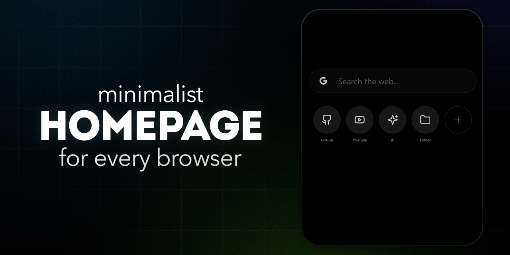

# Homepage Browser

A minimalist, zero-dependency browser start page with dark theme, widgets, and folders.



## 🌟 Features

- **Zero Dependencies** — no CDN, no frameworks, no external requests
- **Minimalist Design** — clean AMOLED black interface
- **Search** — supports Google, Yandex, DuckDuckGo with quick switching
- **Widgets** — create shortcuts for your favorite websites
- **Folders** — organize widgets into swipeable groups (3×3 grid)
- **Customization** — adjust widget size, spacing, icon shape, theme, and add button visibility
- **Export/Import** — save and restore all settings to a JSON file
- **Offline Mode** — Service Worker caches everything for instant loading
- **Built-in SVG Icons** — 18 icons included, no external icon libraries

## 🚀 Installation

### Using as Homepage

1. **Deploy the project** to GitHub Pages, Netlify, Vercel, or any static hosting
2. **Copy the URL** of your deployed project
3. **Set it as homepage** in your browser settings

#### Samsung Internet
1. Menu → **Settings** → **Homepage** → **Custom page**
2. Paste the project URL

#### Chrome
1. **Settings** → **Appearance** → Enable **Show Home button**
2. Select **Enter custom web address** → Paste the URL

#### Firefox
1. **Settings** → **Home** → **Homepage and new windows** → **Custom URLs**
2. Paste the project URL

### Local Run

Open `index.html` directly in a browser or start a local server:

```bash
python -m http.server 8000
# Then open http://localhost:8000
```

## ⚙️ Settings

### Themes
- **AMOLED** — pure black (#000)
- **Black** — dark gray (#121212)

### Icon Shape
- **Square** — rounded corners (12px)
- **Round** — circular (50% border-radius)

### Folder Styles
- **Preview** — shows 4 mini-icons inside the folder button
- **Icon** — shows a single folder icon

### Sizes & Spacing
- Widget size (40–80px)
- Horizontal gap between widgets (0–40px)
- Vertical gap between widgets (0–40px)
- Search-to-widgets gap (0–80px)

### Add Button
- **Show** — displays the "+" button in the widget grid
- **Hide** — removes the "+" button (use context menu instead)

## 📋 Usage

### Widget Context Menu
Right-click or long-press any widget:
- **Move Left/Right** — reorder widgets
- **Edit** — change title, URL, or icon
- **Move to Group** — add widget to a folder
- **Remove from Folder** — extract widget from a group
- **Delete** — remove widget permanently

### Folder Context Menu
Right-click or long-press a widget inside an open folder:
- **Remove from Folder** — move back to the main grid
- **Delete** — remove widget permanently

### Empty Space Context Menu
Right-click or long-press any empty area:
- **Settings** — open customization panel
- **Add Widget** — create a new shortcut
- **Add Folder** — create a new group

### Keyboard Navigation
- **Swipe left/right** inside folders (touch devices and mouse drag)
- **Click pagination dots** to navigate folder pages

## 📁 Project Structure

```
Homepage Browser/
├── index.html      # All HTML + inline CSS (Tailwind v4 built + custom)
├── app.js          # Application logic + 18 built-in SVG icons
├── sw.js           # Service Worker for offline PWA support
├── style.css       # Backup of custom styles (reference only)
└── README.md       # This file
```

## 💾 Backup & Restore

Use **Export** and **Import** buttons in Settings to save/load all widgets, folders, search engine, and preferences as a single JSON file.

## 🛠 Technologies

| Tech | Usage |
|------|-------|
| **HTML5** | Semantic markup, inline CSS |
| **CSS3** | Tailwind v4 (pre-built, no CDN) + custom styles |
| **JavaScript** | Vanilla ES6, no frameworks |
| **SVG Icons** | 18 built-in icons, no external libraries |
| **Service Worker** | PWA caching, offline-first |

## 📝 Notes

- All data is stored in browser `localStorage` (keys: `startpage_widgets_v5`, `startpage_engine_v1`, `startpage_settings_v1`)
- **Zero network requests** after the first load — everything is self-contained
- Service Worker caches `index.html`, `app.js`, and `sw.js` for instant offline access
- Swipe gestures use `translateX` with resistance on edges for a native feel
- Folder pages show 9 widgets at a time (3×3 grid)

## 📄 License

MIT
